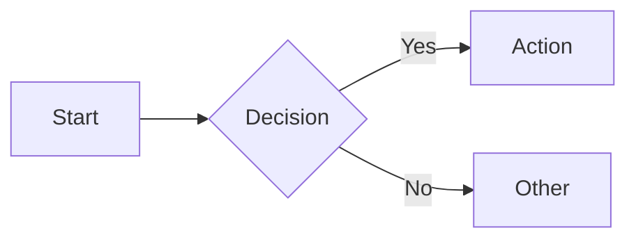

# Course Creator

Create structured training courses for the mycourse.work platform with rich markdown content, interactive quizzes, and mermaid diagrams.

## Workflow

1. Gather requirements (topic, audience, scope, modules)
2. Create directory structure and `manifest.json`
3. Write lesson markdown files
4. Create quiz JSON files
5. Add assets (cover image, diagrams)
6. Validate with `pnpm validate-course <path>`
7. Create a zip of the course: `cd <parent-dir> && zip -r <course-id>.zip <course-id>/`

## Course Directory Structure

```
{course-id}/
├── manifest.json
├── assets/
│   ├── cover.png
│   └── diagram.png
├── 01_Module_Name/
│   ├── 01_Lesson_Title.md
│   ├── 02_Another_Lesson.md
│   └── 03_Quiz.json
└── 02_Second_Module/
    ├── 01_First_Lesson.md
    └── 02_Quiz.json
```

**Naming rules:**
- Course ID: lowercase hyphenated slug (`ai-for-business`)
- Modules: `{##}_{Name}` with underscores, zero-padded
- Lessons: `{##}_{Title}.md`
- Quizzes: `{##}_Quiz.json`

## Manifest

See [references/manifest-schema.md](references/manifest-schema.md) for the full manifest.json schema. Key rules:

- `id` must match the folder name
- Lesson IDs: `{moduleId}|||{lessonFileName}` (no extension)
- Paths are absolute: `/courses/{courseId}/01_Module/01_Lesson.md`
- Indices are 1-based and sequential
- Lesson `type`: `"content"` or `"quiz"`

## Lesson Content

Lessons are markdown files. The platform renders them with rich features.

### Basic Structure

```markdown
# Lesson Title

Introduction paragraph.

## Learning Objectives
- Objective 1
- Objective 2

## Main Content

Paragraphs, lists, links, bold, italic — all standard markdown.

## Key Takeaways
- Summary 1
- Summary 2
```

**Rules:** Start with H1. Don't skip heading levels (H2 to H4 without H3). Target 800-1500 words per lesson.

### Callout Blockquotes

The first bold word determines the style:

```markdown
> **Tip:** Green callout with lightbulb icon.

> **Warning:** Amber callout with triangle icon.

> **Important:** Purple callout with star icon.

> **Danger:** Red callout with alert icon.
```

Keywords: `Tip`/`Hint` (green), `Warning`/`Caution` (amber), `Important`/`Key` (purple), `Danger`/`Error` (red). Any other first word renders as blue info.

### Code Blocks

Fenced code blocks with language tag get syntax highlighting (Shiki, github-dark theme) and a copy button.

Supported languages: javascript, typescript, python, html, css, json, markdown, bash, shell, vue, jsx, tsx, sql, yaml, go, rust, java, c, cpp, csharp, php, ruby, swift, kotlin.

### Mermaid Diagrams

Use fenced code blocks with `mermaid` language:

````markdown

````

All standard mermaid types work: flowchart, graph, sequence, class, state, mindmap, etc. Diagrams render with an expand-to-fullscreen button and zoom/pan controls.

### Math (KaTeX)

Inline: `$E = mc^2$`
Display block: `$$\sum_{i=1}^{n} x_i$$`

### Images

```markdown

```

Images are lazy-loaded, responsive, and rendered with rounded corners. Place files in the `assets/` directory.

### Video Embeds

YouTube/Vimeo via iframe directive:

```markdown
:::iframe
https://www.youtube.com/embed/VIDEO_ID
:::
```

Vimeo URLs in standalone links are also auto-embedded.

### Tables

Standard GFM tables with sticky headers, zebra striping, and hover highlighting:

```markdown
| Header 1 | Header 2 |
|----------|----------|
| Cell 1   | Cell 2   |
```

### Task Lists

```markdown
- [x] Completed item
- [ ] Pending item
```

### External Links

Standalone links on their own line render as preview cards with domain badges. All external links open in new tabs.

## Quizzes

See [references/quiz-schema.md](references/quiz-schema.md) for the full quiz JSON schema with examples of all three question types.

**Key points:**
- Three types: `MULTIPLE_CHOICE`, `MULTIPLE_RESPONSE`, `MATCHING`
- Use `correct: true/false` (never `isCorrect`)
- Always include `feedback` with explanations
- Answer IDs: `{questionId}_{letter}` (e.g. `q1_a`, `q1_b`)
- 5-10 questions per module quiz, `passingScore` typically 70-80
- Mix question types for engagement

## Validation

```bash
pnpm validate-course content/tenants/{tenant}/courses/{course-id}
```

Checks manifest structure, markdown quality (headings, images), mermaid syntax, and quiz correctness. Fix all errors before uploading.

## Packaging

After validation passes, create a zip archive of the course folder:

```bash
cd content/tenants/{tenant}/courses
zip -r {course-id}.zip {course-id}/
```

The zip contains everything needed to import the course: manifest, lessons, quizzes, and assets.
